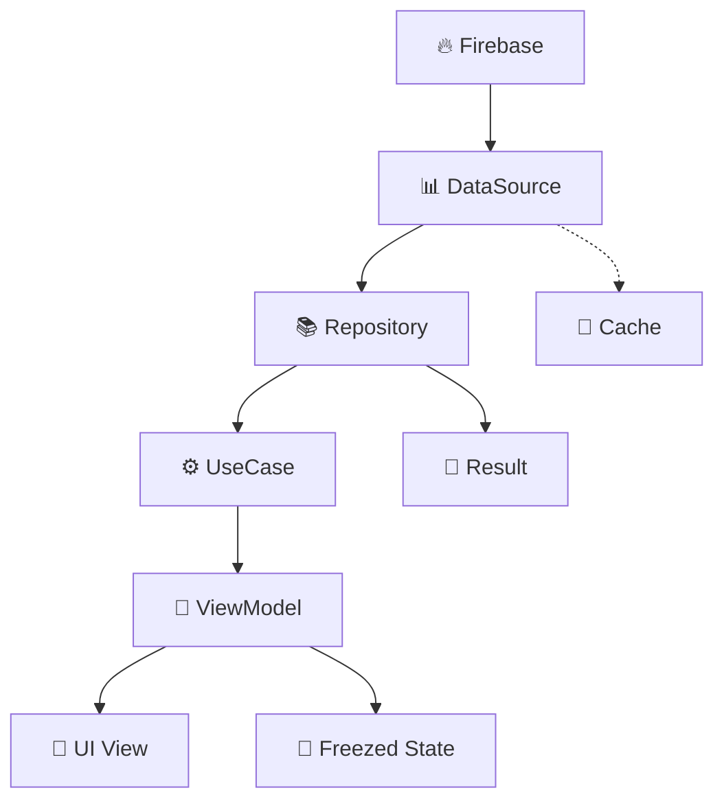

# 📚 Flutter Firebase Clean Architecture Documentation

> **Enterprise-grade Flutter app template** with complete Clean Architecture + Firebase implementation

## 🏗️ Tech Stack & Architecture

| Category | Technology | Purpose |
|----------|------------|---------|
| **Architecture** | Clean Architecture + MVVM | Separation of concerns, testability |
| **State Management** | Provider + ChangeNotifier | Simple, scalable state management |
| **Data Classes** | Freezed 3.0 (sealed class) | Immutable models with code generation |
| **Backend** | Firebase Auth + Firestore | Authentication and real-time database |
| **Navigation** | GoRouter | Declarative routing with type safety |
| **Error Handling** | Result<T> Pattern | Type-safe error handling |
| **Notifications** | flutter_local_notifications | 로컬 알림 (FCM 미사용) |
| **UI Components** | flutter_slidable, table_calendar | 스와이프 액션, 달력 뷰 |
| **Data Flow** | Firebase → Repository → UseCase → ViewModel(State) → View | Clean data flow |

## 🚀 Quick Start

### Prerequisites
- Flutter 3.19+
- Dart 3.3+
- Firebase project setup

### Development Setup
```bash
# Code generation
dart run build_runner build
```

## 📖 Documentation Structure

```
docs/
├── 📐 arch/                           # Architecture & Design Patterns
│   ├── layer.md                       # 🧱 Clean Architecture layers
│   ├── provider.md                    # 🧩 Provider dependency injection
│   ├── result.md                      # 🎯 Result<T> error handling pattern
│   ├── caching.md                     # 💾 Caching strategies (향후 계획)
│   ├── naming.md                      # 🏷️ Naming conventions & Firebase patterns
│   ├── route.md                       # 🛣️ GoRouter navigation & auth guards
│   ├── firebase.md                    # 🔥 Firebase integration & Firestore guide
│   └── performance.md                 # ⚡ Performance optimization guide
│
├── 🧠 logic/                          # Business Logic Layer
│   ├── main.dart.md                   # 🚀 App entry point & Provider setup
│   │
│   ├── domain/                        # Domain Layer
│   │   ├── model.md                   # 🧬 Domain models (Freezed 3.0)
│   │   ├── repository.md              # 📚 Repository interfaces
│   │   └── usecase.md                 # ⚙️ Business logic use cases
│   │
│   ├── data/                          # Data Layer
│   │   ├── datasource.md              # 🌐 Data sources (Firebase priority)
│   │   ├── dto.md                     # 📥 Data Transfer Objects (Freezed)
│   │   ├── mapper.md                  # 🔄 Extension-based mapping
│   │   └── repository_impl.md         # 📚 Repository implementations
│   │
│   └── ui/                            # Presentation Layer
│       ├── view.md                    # 🖥️ View composition guide
│       ├── viewmodel.md               # 🧩 ViewModel state management
│       └── state.md                   # 🧱 Freezed state modeling
│
├── 🔥 firebase/                       # Firebase Integration Guides
│   ├── firebase_caching.md            # 💾 Firebase-specific caching
│   ├── apple_login/                   # 🍎 Apple Sign-In setup
│   ├── google_login/                  # 🔵 Google Sign-In setup
│   ├── kakao_login/                   # 🟡 Kakao Sign-In setup
│
└── 📚 README.md                       # This documentation guide
```

## 🏗️ Architecture Overview

### Core Data Flow


### Layer Responsibilities

| Layer | Purpose | Key Components |
|-------|---------|----------------|
| **🎨 Presentation** | UI rendering & user interaction | View, ViewModel, State |
| **🧠 Domain** | Business logic & rules | UseCase, Model, Repository Interface |
| **📊 Data** | External data access | DataSource, DTO, Repository Implementation |

---

## 📚 Documentation Guide

### 🚀 Getting Started (Read First)
1. **[main.dart.md](logic/main.dart.md)** - App entry point & Provider setup
2. **[layer.md](arch/layer.md)** - Clean Architecture fundamentals
3. **[firebase.md](arch/firebase.md)** - Firebase setup guide

### 🏗️ Architecture Patterns
| File | Purpose | When to Read |
|------|---------|--------------|
| **[provider.md](arch/provider.md)** | Dependency injection setup | Setting up DI container |
| **[result.md](arch/result.md)** | Error handling patterns | Implementing error handling |
| **[route.md](arch/route.md)** | Navigation & auth guards | Implementing navigation |
| **[naming.md](arch/naming.md)** | Coding conventions | Naming classes/methods |
| **[performance.md](arch/performance.md)** | Performance optimization | const, Selector, ListView.builder |
| **[caching.md](arch/caching.md)** | Caching strategies (향후) | DataSource-level caching |

### 🧠 Business Logic Implementation

#### Domain Layer
| File | Purpose | When to Read |
|------|---------|--------------|
| **[model.md](logic/domain/model.md)** | Domain models | Creating business entities |
| **[usecase.md](logic/domain/usecase.md)** | Business operations | Implementing business logic |
| **[repository.md](logic/domain/repository.md)** | Repository interfaces | Defining data access contracts |

#### Data Layer
| File | Purpose | When to Read |
|------|---------|--------------|
| **[datasource.md](logic/data/datasource.md)** | External data access | Integrating APIs/Firebase |
| **[dto.md](logic/data/dto.md)** | Data transfer objects | Handling API responses |
| **[mapper.md](logic/data/mapper.md)** | Data transformations | Converting between layers |
| **[repository_impl.md](logic/data/repository_impl.md)** | Repository implementations | Implementing data repositories |

### 🎨 UI Development
| File | Purpose | When to Read |
|------|---------|--------------|
| **[viewmodel.md](logic/ui/viewmodel.md)** | State management | Managing screen state |
| **[state.md](logic/ui/state.md)** | UI state modeling | Defining screen states |
| **[view.md](logic/ui/view.md)** | View composition | Building UI views |

### 🔥 Firebase Integration
| File | Purpose | When to Read |
|------|---------|--------------|
| **[firebase_caching.md](firebase/firebase_caching.md)** | Firebase caching patterns | Optimizing Firestore queries |
| **[firestore_advanced.md](firebase/firestore_advanced.md)** | Advanced Firestore patterns | Distributed counters, transactions |
| **[apple_login/](firebase/apple_login/)** | Apple Sign-In guide | Adding Apple authentication |
| **[google_login/](firebase/google_login/)** | Google Sign-In guide | Adding Google authentication |
| **[kakao_login/](firebase/kakao_login/)** | Kakao Sign-In guide | Adding Kakao authentication |

## 🎯 Key Design Patterns
- **🏗️ Clean Architecture** - Clear separation of concerns
- **📐 MVVM Pattern** - Model-View-ViewModel architecture
- **🎯 Result<T> Pattern** - Type-safe error handling
- **🔄 Extension Mappers** - Natural data transformations
- **🧱 Freezed Models** - Immutable state management
- **🧩 Provider DI** - Dependency injection container
- **💾 Decorator Caching** - DataSource-level caching with TTL

---

## 💡 Development Workflows

### Adding a New Feature
1. **Domain Layer**: Create models in `domain/model/`
2. **Domain Layer**: Define repository interface in `domain/repository/`
3. **Domain Layer**: Implement use cases in `domain/usecase/`
4. **Data Layer**: Add DTOs in `data/dto/`
5. **Data Layer**: Create DataSource in `data/datasource/`
6. **Data Layer**: Implement repository in `data/repository_impl/`
7. **Data Layer**: Add mappers in `data/mapper/`
8. **UI Layer**: Create State, ViewModel, View in `ui/[feature]/`
9. **Providers**: Register in `core/di/`
10. **Navigation**: Add routes in `core/route/router.dart`

### Testing Strategy
- **Unit Tests**: Models, UseCases, Repositories
- **Widget Tests**: UI components and views
- **Integration Tests**: End-to-end user flows

---

## 🔧 Development Guidelines

### Code Quality
- **Type Safety**: Leverage Dart's null safety
- **Immutability**: Use Freezed for data classes
- **Error Handling**: Always use Result<T> pattern
- **Testing**: Write tests for business logic
- **Documentation**: Keep docs updated with changes

### Performance
- **State Management**: Use Selector for specific rebuilds (not Consumer)
- **Caching**: Use Decorator pattern for DataSource caching
- **Firebase**: Use appropriate query limits and indexes
- **Images**: Optimize image loading with cacheWidth

---

## 📞 How to Use This Documentation

### For New Projects
1. Copy this `docs/` folder to your new Flutter + Firebase project
2. Read **Getting Started** section first
3. Follow the **Adding a New Feature** workflow
4. Reference Firebase guides when adding authentication

### For Existing Projects
1. Review architecture patterns in `arch/` folder
2. Apply patterns incrementally to existing code
3. Use caching guide for performance optimization

### For AI-Assisted Development (Vibe Coding)
1. Provide this docs folder to AI assistant
2. AI will follow the same architecture patterns
3. Consistent code generation across the project

---

*This documentation provides a **reusable architecture template** for Flutter + Firebase applications with Clean Architecture, ensuring consistent patterns across projects.*

---
